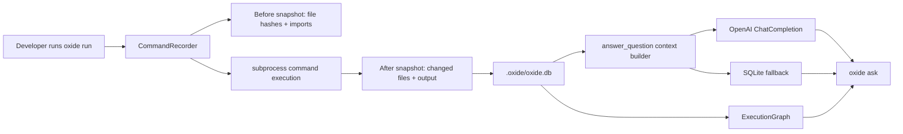

# Oxide Technical Overview

Oxide is split into three layers:

- `oxide_daemon`: records commands and file-system effects.
- `oxide_ai`: builds context, graph analysis, prompts, and natural-language answers.
- `cli.py`: exposes the terminal commands and ASCII UI.

## Architecture



## Recording Flow

`oxide_daemon.recorder.CommandRecorder` is the core recorder.

For each command:

1. Resolve the working directory.
2. Capture an input snapshot of files in the project.
3. Hash file contents with `hashlib.blake2b`.
4. Capture modules imported by the recorder process.
5. Execute the command with `subprocess.Popen`.
6. Capture stdout, stderr, exit code, timeout state, and spawn errors.
7. Capture an output snapshot.
8. Compute `new_files`, `changed_files`, and `deleted_files`.
9. Store everything in SQLite.

## SQLite Storage

The database lives at:

```text
.oxide/oxide.db
```

The main table is `command_runs`:

- `command_hash`: stable hash for command + cwd + shell mode.
- `command`: JSON command string or argv list.
- `input_snapshot`: JSON file hashes before execution.
- `output_snapshot`: JSON stdout/stderr, exit code, changed files.
- `timestamp`: UTC ISO timestamp.
- `deps`: JSON dependency metadata, including Python imports.

## Hashing

Oxide uses `blake2b` content hashes.

Why:

- Fast.
- Built into Python.
- Good for content-addressed tracking.
- Lets Oxide detect file changes without storing every full file body.

## Python Import Tracking

When a Python command runs, Oxide injects a temporary `sitecustomize.py` through `PYTHONPATH`.

That tracker records:

- imported module names,
- module file paths,
- module content hashes,
- module sizes and mtimes.

This gives extra forensic evidence for Python commands.

## Git Bash And Windows Handling

On Windows, `bash` can accidentally resolve to the WSL app shim. If WSL has no distro installed, commands fail before running.

Oxide now detects Git Bash and launches:

```text
C:\Program Files\Git\bin\bash.exe
```

It avoids broken WindowsApps and System32 bash shims.

Oxide also prepends its own Python runtime path to child commands, so this works in Git Bash:

```bash
oxide run "python -c \"print('ok')\""
```

even if Git Bash did not already have `python` on PATH.

## AI Query Flow

`oxide_ai.query_engine.answer_question(question, oxide_dir=".oxide")`:

1. Loads `.oxide/oxide.db`.
2. Reads the last 50 command runs.
3. Builds a context dictionary:
   - `recent_commands`
   - `file_changes`
   - `failures`
   - `command_graph`
4. Calls OpenAI Chat Completions using `OPENAI_API_KEY`.
5. If OpenAI is unavailable, falls back to direct SQLite answers.

Outputs are truncated to 500 characters for token management.

## Graph Analysis

`oxide_ai.graph_analyzer.ExecutionGraph` uses `networkx`.

It builds a directed graph:

- Command nodes contain command metadata.
- File nodes contain paths and hashes.
- `file -> command` means the command had that file in its pre-run snapshot.
- `command -> file` means the command wrote, modified, or deleted that file.

Supported graph operations:

- shortest path between nodes,
- upstream dependencies,
- downstream impact,
- topological sort,
- cycle detection.

## CLI Commands

```bash
oxide init
oxide run "command"
oxide status
oxide ask "question"
oxide lineage path/to/file
oxide graph
oxide timeline --since "2 hours ago"
oxide doctor
oxide guide
oxide reset --yes
```

## Current Limitations

Oxide currently tracks reads through snapshots, not OS syscall-level tracing.

That means:

- Writes and modifications are reliable.
- "Which command changed this file?" is strong.
- "Which exact files did this command read?" is approximate.

The next production upgrade is a lower-level watcher/syscall integration.

## Tech Stack

- Python 3.10+
- SQLite
- Click
- NetworkX
- dateparser
- OpenAI Python SDK
- blake2b hashing
- subprocess command execution
- Git Bash support on Windows
